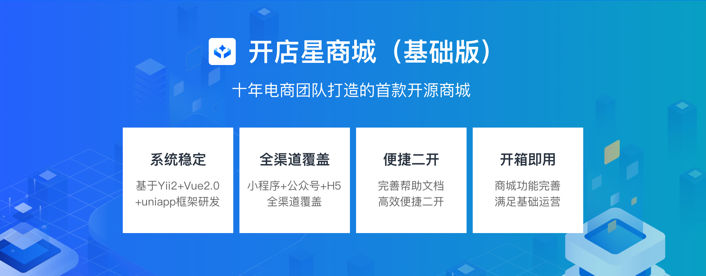
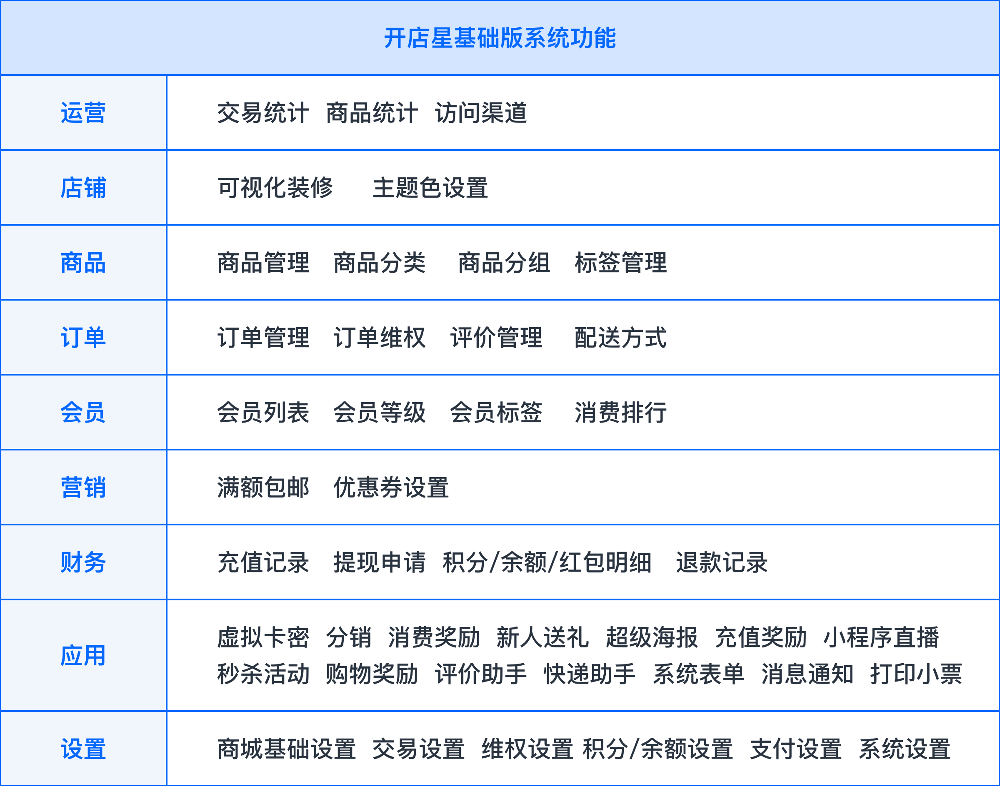

&nbsp;

开店星商城基础版，是由十年电商技术团队打造的首款开源单商户商城系统，功能完善可满足基础运营，开箱即用，便捷二开。
&nbsp;
基于Yii2+Vue2.0+uniapp 研发，系统架构稳定；商城商品、订单、用户精细化管理；涵盖基础营销插件；小程序+公众号+H5，全渠道覆盖。功能强大，安全便捷，框架成熟稳定便于扩展，源码开源，支持二次开发，让企业用更低的成本搭建个性化商城。

&nbsp;

| **系统优势**    |   **技术优势**  |
| --- | --- |
| **高扩展性**：标准API接口，前后端分离，支持多端开发，多种驱动    |  **移动框架**：采用uniapp多端支持，快速编译成各种格式的代码   |
| **低耦合性**：每个功能模块接口独立，程序、模板、数据库独立   |  **后端框架**：采用稳定易上手的Yii2框架   |
|**易二开上手**：标准化组件、接口文档、开发文档等，详细代码备注 |**接口规范**：标准API接口，二开更便捷 |
| **高性能**：支持负载均衡、分布式部署、页面缓存，支持高并发    |**数据导出更便捷**：数据导出采用phpExcel,数据更加直观，便于管理统计     |
|  **静态化分离**：支持多种云储存，阿里云OSS、腾讯云COS等   |  **插件钩子机制**：钩子机制插件，功能模块独立，利于二开   |
| **一键安装**：自动检查系统环境，错误提示说明、修改方法 | **高频数据缓存**：数据库读写分离，减轻服务器压力，提升访问速度 |

&nbsp;

## **开店星基础版体验**：

（附演示站小程序码+公众号二维码，图片展示）

## 演示站地址：

## 账号：

## 密码：

&nbsp;

## **官方技术交流群**：

交流①群：

交流②群：

&nbsp;

## **帮助文档**：

[https://www.kancloud.cn/book/kaidianxing2022/kaidianxing-2022/release/1465908]()

&nbsp;

## **官网**

[ www.kaidianxing.com]()

&nbsp;

## **如何交流反馈、参与贡献**？

*   gitee仓库——[链接]()
*   github仓库——[链接]()

&nbsp;
## **核心技术**：

*   前端技术栈 ES6、vue、vuex、vue-router、vue-cli、axios、uni-app、 iView、echarts、vant
* 后端技术栈：PHP，Yii2，Mysql，Redis

&nbsp;
## **技术亮点**：

* 基于命名空间和PSR-4规范，加入了PHP7新特性

* 前后端分离架构，前端使用uniapp，以API进行数据对接

* 支持composer，基于全新的架构思想和命名空间

* MVC结构的基础上加入Service层，满足多个Model数据处理的需求，减少代码冗余

* 注解方式的常量配置，通过类反射机制来获取各个配置选项，使配置添加和使用更为灵活

* 使用easywechant库包进行底层对接微信公众号，微信小程序等等

* 使用yansongda库包完成微信支付和支付宝支付

* 组件化封装实现底层，配置注入工厂类获取应用实例方式，满足多场景支持（比如：阿里云存储，七牛云存储等多种存储支持）

* 规范统一的api错误码，以及详细的解释文档，让您可以在开发中快速定位问题

* 后台RABC控制权限

* Api的访问权限，在框架层面统一处理，业务编码不需要考虑权限问题，让系统更为安全，开发更为便捷。

* 高效的urlManager管理，在框架层面对路由做统一的处理

* 业务功能模块化，插件化，代码结构更为清晰

* 特性traits的应用，减少代码冗余，让代码结构更为清晰

* 主动触发CRON的方式，让您无需单独linux配置CRON0

* 高效的缓存机制，使用Redis存储缓存，让网站响应更快

* 队列Queue的应用，短信发送，微信推送使用MQ进行解耦，让您的系统更快更高效

* 可视化的DIY店铺装修，让您随心所欲的打扮自己的商城

* 一键安装，让您更为方便的搭建商城

* 完善的开发文档，二次开发更快入门

## **功能列表：**

&nbsp;

## **页面展示：**